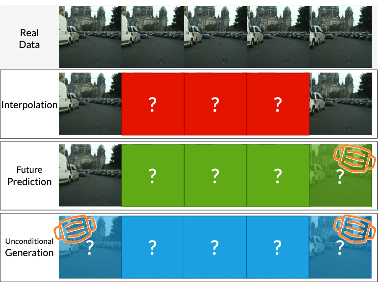

<h1 align="center"> Mask Condition Video Diffusion</h1>

<h3 align="center"> <a href="https://voletiv.github.io" target="_blank">Vikram Voleti</a>*, <a href="https://ajolicoeur.wordpress.com/about/" target="_blank">Alexia Jolicoeur-Martineau</a>*, <a href="https://sites.google.com/view/christopher-pal" target="_blank">Chris Pal</a></h3>

<h3 align="center"> [Paper](xxxxxxxx), [Code](https://github.com/voletiv/ncsnv2-gff), Blog </h3>

&nbsp;

<h3 align="center"> Summary </h3>

* General purpose model for video generation, forward/backward prediction, and interpolation
* Uses a [score-based diffusion loss function](https://yang-song.github.io/blog/2021/score/) to generate novel frames
* Injects Gaussian noise into the current frames and denoises them conditional on past and/or future frames
* Randomly *masks* past and/or future frames during training which allows the model to handle the four cases:
  * Interpolation : both past and present are known
  * Prediction : the past/future is known
  * Unconditional Generation : the past and future are unknown
* Uses a [2D convolutional U-Net](https://arxiv.org/abs/2006.11239) instead of a complex 3D or recurrent or transformer architecture
* Conditions on past and future frames through concatenation or space-time adaptive normalization
* Produces high-quality and diverse video samples
* Trains on only 1-4 GPUs
* Scales well with the number of channels, and could be scaled much further than in the paper

<h3 align="center"> Abstract </h3>

Current state-of-the-art (SOTA) methods for video prediction/generation generally require complex 3D Transformers or recurrent auto-encoders. In spite of these complex architectures, results often remain low quality due to significant underfitting. On the other hand, the very few methods that don't underfit often require complex data augmentations to prevent severe overfitting which limits generalization beyond the training data. Meanwhile, we achieve SOTA results with a simple architecture with no recurrent layer, expensive 3D convolution, space-time attention, or complex data augmentation (except for the Gaussian noise added by the diffusion loss). They key to achieving such high quality videos is the use of a diffusion loss function and conditioning on past frames through concatenation or space-time adaptive normalization.
{: style="text-align: justify"}

## Video Prediction

left (with frame number) : real image

right : predicted image

'c' : conditional frame

### Cityscapes (128x128)
cond=2, train=5, autoregressive pred=30

### KTH (64x64)
cond=10, train=5, autoregressive pred=20

### Stochastic Moving MNIST (64x64)
cond=5, train=5, autoregressive pred=20

