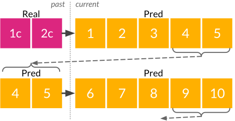
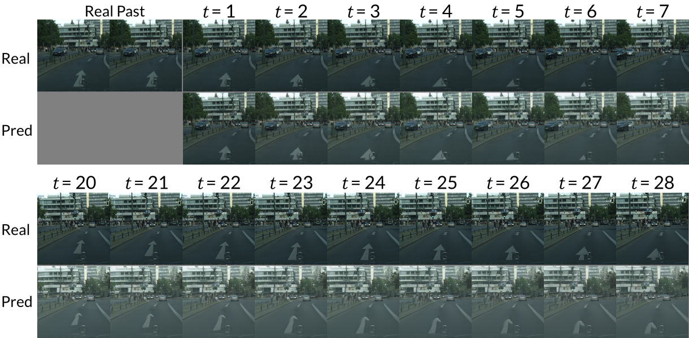
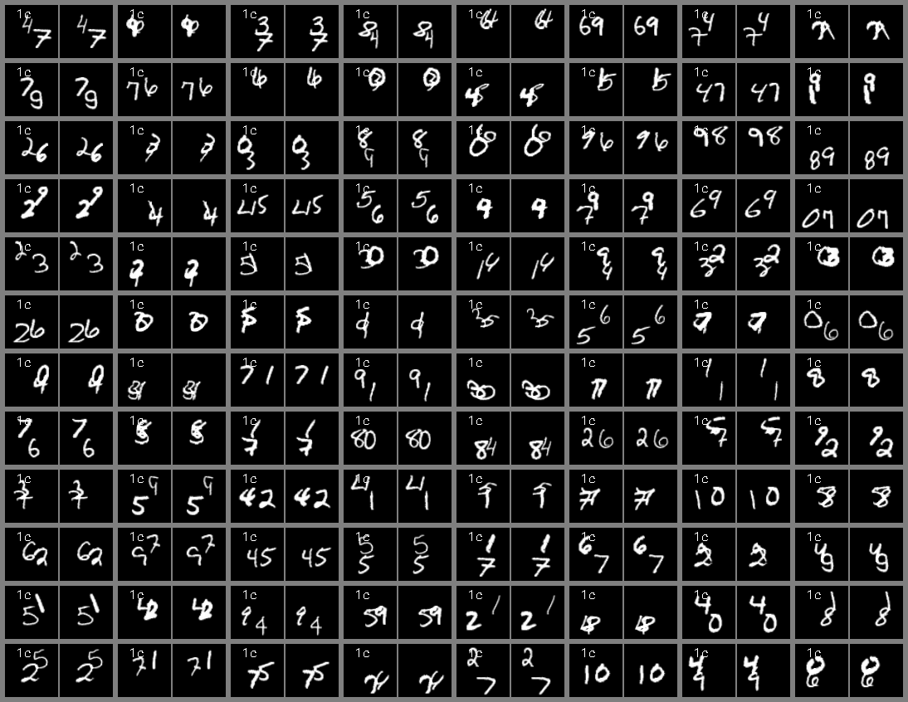

<h1 align="center"> Masked Conditional Video Diffusion for   Generation, Prediction, and Interpolation </h1>

<h3 align="center"> <a href="https://voletiv.github.io" target="_blank">Vikram Voleti</a>*, <a href="https://ajolicoeur.wordpress.com/about/" target="_blank">Alexia Jolicoeur-Martineau</a>*, <a href="https://sites.google.com/view/christopher-pal" target="_blank">Chris Pal</a></h3>

<h3 align="center"> [Paper](xxxxxxxx), Code(TBD), Blog (TBD) </h3>

&nbsp;

<h3 align="center">  </h3>

<h3 align="center"> Summary </h3>

* General purpose model for video generation, forward/backward prediction, and interpolation
* Uses a [score-based diffusion loss function](https://yang-song.github.io/blog/2021/score/) to generate novel frames
* Injects Gaussian noise into the current frames and denoises them conditional on past and/or future frames
* Randomly *masks* past and/or future frames during training which allows the model to handle the four cases:
  * Unconditional Generation : both past and future are unknown
  * Future Prediction : only the past is known
  * Past Reconstruction : only the future is known
  * Interpolation : both past and present are known
* Uses a [2D convolutional U-Net](https://arxiv.org/abs/2006.11239) instead of a complex 3D or recurrent or transformer architecture
* Conditions on past and future frames through concatenation or space-time adaptive normalization
* Produces high-quality and diverse video samples
* Trains with only 1-4 GPUs
* Scales well with the number of channels, and could be scaled much further than in the paper

<h3 align="center"> Abstract </h3>

Current state-of-the-art (SOTA) methods for video prediction/generation generally require complex 3D Transformers or recurrent auto-encoders. In spite of these complex architectures, results often remain low quality due to significant underfitting. On the other hand, the very few methods that don't underfit often require complex data augmentations to prevent severe overfitting which limits generalization beyond the training data. Meanwhile, we achieve SOTA results with a simple architecture with no recurrent layer, expensive 3D convolution, space-time attention, or complex data augmentation (except for the Gaussian noise added by the diffusion loss). They key to achieving such high quality videos is the use of a diffusion loss function and conditioning on past frames through concatenation or space-time adaptive normalization.
{: style="text-align: justify"}

&nbsp;

<h1 align="center"> Video Prediction </h1>

First, we use real `past` frames to predict `current` frames. Then, we autoregressively predict the next `current` frames using the last predicted frames as the new `past` frames (free-running):

<h3 align="center">  </h3>

* *left column (with frame number)* : real image 
* *right column* : predicted image

&nbsp;

### Cityscapes (128x128)

`past`=2, `current`=5, autoregressive `pred`=28

&nbsp;

<h3 align="center">  </h3>

Our approach generates high quality frames many steps into the future: Given the two conditioning frames from the [Cityscapes](https://www.cityscapes-dataset.com/) validation set (top left), we show 7 predicted future frames in row 2 below, then skip to frames 20-28, autoregressively predicted in row 4. Ground truth frames are shown in rows 1 and 3. Notice the initial large arrow advancing and passing under the car. At frame 20 (the far left of the 3rd and 4th row), the initially small and barely visible second arrow in the background of the conditioning frames has advanced into the foreground.

&nbsp;

### KTH (64x64)

`past`=10, `current`=5, autoregressive `pred`=20

&nbsp;

### Stochastic Moving MNIST (64x64)

`past`=5, `current`=5, autoregressive `pred`=20

&nbsp;

<h1 align="center"> Video Interpolation </h1>

* *left column (with frame number)* : real image 
* *right column* : predicted image

&nbsp;

### KTH (64x64)

`past`=10, **`interp`=10**, `future`=5

&nbsp;

### Stochastic Moving MNIST (64x64)

`past`=5, **`interp`=5**, `future`=5

