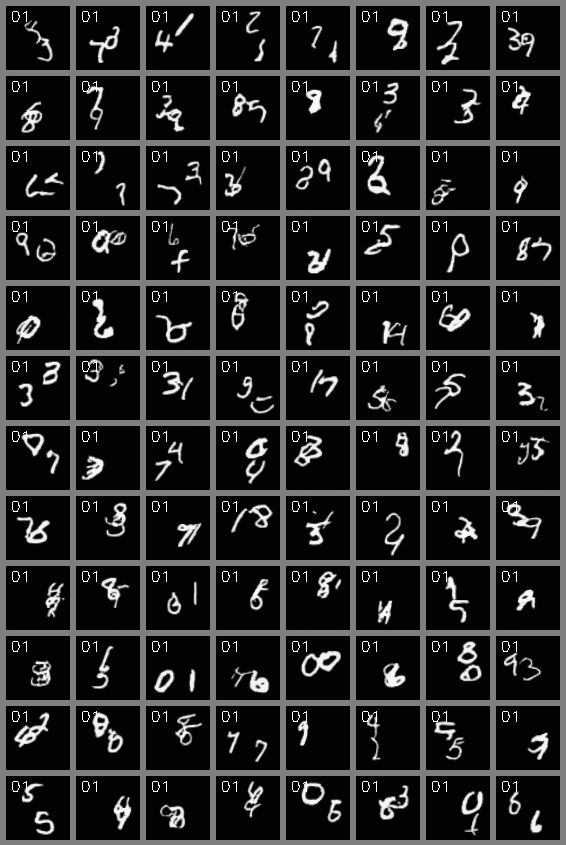

<h1 align="center"> MCVD: Masked Conditional Video Diffusion<br/>for Prediction, Generation, and Interpolation </h1>

<h3 align="center"> <a href="https://voletiv.github.io" target="_blank">Vikram Voleti</a>*, <a href="https://ajolicoeur.wordpress.com/about/" target="_blank">Alexia Jolicoeur-Martineau</a>*, <a href="https://sites.google.com/view/christopher-pal" target="_blank">Christopher Pal</a></h3>

<h3 align="center"> <a href="https://github.com/voletiv/mcvd-pytorch" target="_blank">Code</a>, <a href="https://arxiv.org/abs/2205.09853" target="_blank">Paper</a>, <a href="https://ajolicoeur.wordpress.com/?p=466" target="_blank">Blog</a> </h3>

&nbsp;

<h3 align="center">  </h3>

<h3 align="center"> Summary </h3>

* General purpose model for video generation, forward/backward prediction, and interpolation
* Uses a [score-based diffusion loss function](https://yang-song.github.io/blog/2021/score/) to generate novel frames
* Injects Gaussian noise into the current frames and denoises them conditional on past and/or future frames
* Randomly *masks* past and/or future frames during training which allows the model to handle the four cases:
  * Unconditional Generation : both past and future are unknown
  * Future Prediction : only the past is known
  * Past Reconstruction : only the future is known
  * Interpolation : both past and present are known
* Uses a [2D convolutional U-Net](https://arxiv.org/abs/2006.11239) instead of a complex 3D or recurrent or transformer architecture
* Conditions on past and future frames through concatenation or space-time adaptive normalization
* Produces high-quality and diverse video samples
* Trains with only 1-4 GPUs
* Scales well with the number of channels, and could be scaled much further than in the paper

<h3 align="center"> Abstract </h3>

Video prediction is a challenging task. The quality of video frames from current state-of-the-art (SOTA) generative models tends to be poor and generalization beyond the training data is difficult. Furthermore, existing prediction frameworks are typically not capable of simultaneously handling other video-related tasks such as unconditional generation or interpolation. In this work, we devise a general-purpose framework called Masked Conditional Video Diffusion (MCVD) for all of these video synthesis tasks using a probabilistic conditional score-based denoising diffusion model, conditioned on past and/or future frames. We train the model in a manner where we randomly and independently mask all the past frames or all the future frames. This novel but straightforward setup allows us to train a single model that is capable of executing a broad range of video tasks, specifically: future/past prediction -- when only future/past frames are masked; unconditional generation -- when both past and future frames are masked; and interpolation -- when neither past nor future frames are masked. Our experiments show that this approach can generate high-quality frames for diverse types of videos. Our MCVD models are built from simple non-recurrent 2D-convolutional architectures, conditioning on blocks of frames and generating blocks of frames. We generate videos of arbitrary lengths autoregressively in a block-wise manner. Our approach yields SOTA results across standard video prediction and interpolation benchmarks, with computation times for training models measured in 1-12 days using ≤ 4 GPUs.
{: style="text-align: justify"}

```bib
@article{voleti2022MCVD,
  title={Masked Conditional Video Diffusion for Prediction, Generation, and Interpolation},
  author={Voleti, Vikram and Jolicoeur-Martineau, Alexia and Pal, Christopher},
  url={https://arxiv.org/abs/2205.09853},
  journal={arXiv:2205.09853},
  year={2022}}
}
```

&nbsp;

<h1 align="center"> Video Prediction </h1>

First, we use real `past` frames to predict `current` frames. Then, we autoregressively predict the next `current` frames using the last predicted frames as the new `past` frames (free-running):

<h3 align="center">  </h3>

* *left column (with frame number)* : real image 
* *right column* : predicted image

### KTH (64x64)

`past`=10, `current`=5, autoregressive `pred`=20


&nbsp;

### BAIR (64x64)

`past`=2, `current`=5, autoregressive `pred`=28


&nbsp;

### Cityscapes (128x128)

`past`=2, `current`=5, autoregressive `pred`=28


Note that some Cityscapes videos contain brightness changes, which may explain the brightness change in our fake samples, but it is definitively overrepresented in the fake data. More parameters would needed to fix this problem (beyond what we can achieve with our 4 GPUs).
&nbsp;

<h3 align="center">  </h3>

Our approach generates high quality frames many steps into the future: Given the two conditioning frames from the [Cityscapes](https://www.cityscapes-dataset.com/) validation set (top left), we show 7 predicted future frames in row 2 below, then skip to frames 20-28, autoregressively predicted in row 4. Ground truth frames are shown in rows 1 and 3. Notice the initial large arrow advancing and passing under the car. At frame 20 (the far left of the 3rd and 4th row), the initially small and barely visible second arrow in the background of the conditioning frames has advanced into the foreground.

&nbsp;

### Stochastic Moving MNIST (64x64)

`past`=5, `current`=5, autoregressive `pred`=20


In SMMNIST, when two digits overlap during 5 frames, a model conditioning on 5 previous frames will have to guess what those numbers were before overlapping, so they may change randomly. This would be fixed by using a large number of conditioned previous frames. We used 5 to match previous prediction baselines, which start from 5 frames.

&nbsp;


<h1 align="center"> Video Generation </h1>

### KTH (64x64)

<h3 align="center">  </h3>

&nbsp;

### BAIR (64x64)

<h3 align="center">  </h3>

&nbsp;

### Stochastic Moving MNIST (64x64)

<h3 align="center">  </h3>

&nbsp;


<h1 align="center"> Video Interpolation </h1>

* *left column (with frame number)* : real image 
* *right column* : predicted image

### KTH (64x64)

`past`=10, **`interp`=10**, `future`=5


&nbsp;

### BAIR (64x64)

`past`=1, **`interp`=5**, `future`=2

<h3 align="center">  </h3>

&nbsp;

### Stochastic Moving MNIST (64x64)

`past`=5, **`interp`=5**, `future`=5


&nbsp;

<h2 align="center"> SPATIN Architecture </h2>

<h3 align="center">  </h3>


